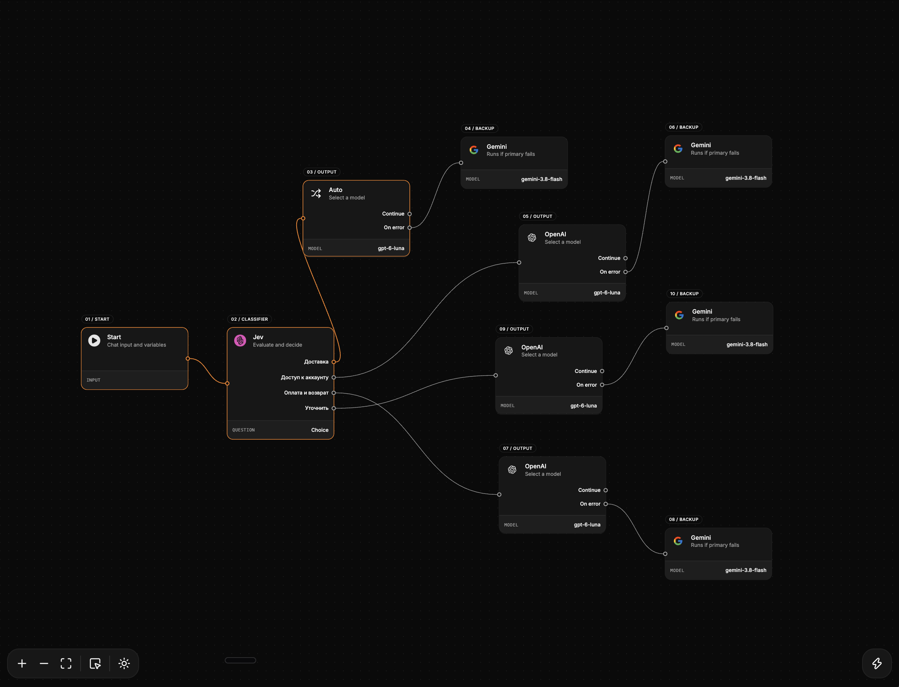

<a href="https://github.com/murabcd/jevgraph">
  
  <h1 align="center">JevGraph</h1>
</a>

<p align="center">
  A Visual AI Chatflow Builder Built With React, Convex, and AI SDK.
</p>

<p align="center">
  <a href="#features"><strong>Features</strong></a> ·
  <a href="#model-providers"><strong>Model Providers</strong></a> ·
  <a href="#deploy-your-own"><strong>Deploy Your Own</strong></a> ·
  <a href="#running-locally"><strong>Running locally</strong></a>
</p>
<br/>

## Features

- [Vite](https://vite.dev)
  - Fast development and builds with [React](https://react.dev)
  - Local server API for graph execution and provider calls
- [AI SDK](https://ai-sdk.dev/docs)
  - Direct providers for text generation and typed Jev evaluations
  - Streamed replies with live execution paths, timing, token usage, and estimated costs
  - Per-node prompts, reasoning controls, context selection, and model routing based on reviewed results
- [React Flow](https://reactflow.dev)
  - Visual chatflows with branching decisions, parallel paths, joined results, bounded review loops, and explicit backup models
- [Shadcn/ui](https://ui.shadcn.com)
  - Styling with [Tailwind CSS](https://tailwindcss.com)
  - Component primitives from [Base UI](https://base-ui.com) for accessibility and flexibility
- Data Persistence
  - [Convex](https://www.convex.dev/) for saving workflows, chat history, and run records
  - [Convex file storage](https://docs.convex.dev/file-storage) for complete execution results and provider evidence
  - [Convex Vector Search](https://docs.convex.dev/search/vector-search) and text search for selected documents and opt-in saved history, with Jev reranking
- [Convex Auth](https://labs.convex.dev/auth)
  - Anonymous authentication with workspace ownership checks

## Model Providers

JevGraph uses [OpenAI](https://openai.com/) and [Google](https://ai.google.dev/) for text generation through their direct [AI SDK](https://ai-sdk.dev/docs) providers. Select the model and reasoning effort in each Model node. [TypeSafe](https://ai-sdk.dev/providers/ai-sdk-providers/typesafe-ai) provides Jev evaluations for decisions and context assessment.

- OpenAI model (`gpt-6-luna`): Text generation with configurable reasoning effort
- Google model (`gemini-3.8-flash`): Text generation with Low, Medium, and High reasoning settings
- Jev model (`jev-latest`): 1–16 named Choice, Noul, and Score questions per reached node, evaluated together with independent confidence thresholds and question-scoped routing outputs

## Deploy Your Own

You can host your own version of JevGraph with a Convex deployment, authentication signing keys, and provider API keys.

The server API currently runs through Vite in development and preview. Hosting the static UI bundle alone does not run chatflows; a production deployment needs a server runtime for the API. A one-click Vercel deployment is not configured yet.

## Running locally

You will need to use the environment variables [defined in `.env.example`](.env.example) to run JevGraph. Store provider keys and your Convex deployment configuration in `.env.local`. Retrieval requires OpenAI embeddings and Jev reranking, including when Gemini generates the answer.

> Note: You should not commit your `.env.local` file or it will expose secrets that allow others to access your provider accounts. Authentication signing keys belong in your Convex deployment.

1. Install dependencies with `bun install`, create `.env.local` with `cp .env.example .env.local`, and fill in `TYPESAFE_API_KEY`, `OPENAI_API_KEY`, and `GOOGLE_GENERATIVE_AI_API_KEY` for the providers you use.
2. Connect a development backend with `bunx convex dev --configure --once`. The CLI writes the Convex deployment configuration into `.env.local`. Set `JWT_PRIVATE_KEY`, `JWKS`, and `SITE_URL=http://localhost:5173` in that deployment following the [manual Convex Auth setup](https://labs.convex.dev/auth/setup/manual).
3. Keep backend synchronization running in a separate terminal: `bun run dev:convex`.

```bash
bun run dev
```

Your app should now be running on [localhost:5173](http://localhost:5173/).
